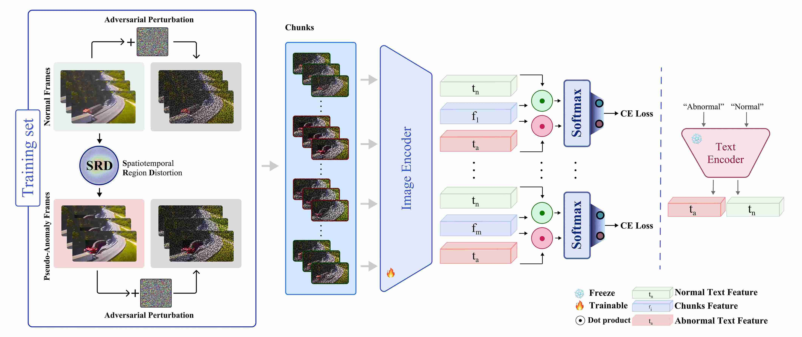

# FrameShield: Adversarially Robust Video Anomaly Detection


> **NeurIPS 2025** \
> *Mojtaba Nafez, Mobina Poulaei\*, Nikan Vasei\*, Bardia soltani moakhar, Mohammad Sabokrou, Mohammad Hossein Rohban* \
> Paper: [OpenReview](https://openreview.net/forum?id=7FLKzOqsKd)




## 📜 Abstract

Weakly Supervised Video Anomaly Detection (WSVAD) has achieved notable advancements, yet existing models remain vulnerable to adversarial attacks, limiting their reliability. Due to weak supervision—where only video-level labels are available—traditional adversarial defenses like adversarial training are ineffective, as video-level perturbations are too weak.

**FrameShield** introduces a *Pseudo-Anomaly Generation* method called **Spatiotemporal Region Distortion (SRD)**, which creates localized synthetic anomalies in normal videos while maintaining temporal consistency. These synthetic samples, combined with noisy pseudo-labels, reduce label noise and enable effective adversarial training.

FrameShield substantially enhances robustness across benchmarks, outperforming state-of-the-art methods by **+71.0% average AUROC improvement** under adversarial settings.

---
 
## 📂 Repository Structure

```
FrameShield/
│
├── clip/                # Base CLIP implementation
├── configs/             # Dataset-specific configuration files
├── datasets/            # Dataset and DataLoader creation scripts
├── models/              # X-CLIP and FrameShield model definitions
├── runners/             # Bash scripts for training/evaluation
├── utils/               # Logging, checkpointing, and helper utilities
│
├── main.py              # Standard (non-adversarial) training / testing
├── main_advtrain.py     # Adversarial training / pseudo label entry point
├── main_attack.py       # Adversarial attack evaluation
│
└── requirements.txt     # Python dependencies
```

---

## ⚙️ Installation

Firstly, download and move into the repository.

```bash
git clone https://github.com/rohban-lab/FrameShield.git
cd FrameShield
```

Secondly, create a python environment. Below there is an example using `conda`.
> It is recommended to use python 3.10, as it is the version we used for the development.

```bash
conda create -n FS python=3.10
conda activate FS
```

Finally, install are the required dependencies using the command below.

```bash
pip install -r requirements.txt
```

---

## 🗂️ Datasets

FrameShield supports multiple benchmark datasets used in the paper:

| Dataset          | Source                                                                | Notes                                         |
| ---------------- | --------------------------------------------------------------------- | --------------------------------------------- |
| **ShanghaiTech** | [Train (Kaggle)](https://www.kaggle.com/datasets/nikanvasei/shanghaitech-campus-dataset) / [Test (Kaggle)](https://www.kaggle.com/datasets/nikanvasei/shanghaitech-campus-dataset-test)                    | Official *ShanghaiTech University* [website](https://svip-lab.github.io/dataset/campus_dataset.html) |
| **TAD**    | [Train+Test (Kaggle)](https://www.kaggle.com/datasets/nikanvasei/traffic-anomaly-dataset-tad)        | Official [repository](https://github.com/ktr-hubrt/WSAL?tab=readme-ov-file)             |
| **UCF Crime**  | [Official Website](https://www.crcv.ucf.edu/projects/real-world/) | Preprocessed for FrameShield                  |
| **MSAD**  | [Project Website](https://msad-dataset.github.io/) | Apply for the dataset directly on their website.                 |
| **UCSD-Ped2**  | [TBD]() | Official [paper](https://www.researchgate.net/publication/221362278_Anomaly_Detection_in_Crowded_Scenes)                  |

### How to use the datasets
Each dataset should be placed under a root directory, which is specified in your `config` file. 

```yaml
DATA:
    ROOT: '../SHANGHAI/' <-- The root directory
    TRAIN_FILE: 'configs/shanghai/SHANGHAI_train.txt'
    VAL_FILE: 'configs/shanghai/SHANGHAI_test.txt'
    DATASET: shanghai
    .
    .
```

See example configs in [`configs/`](configs/).

> *Note: Depending on your dataset format, and how clean the frame indices are, you might need to change how the frames are loaded into the dataloaders.*

---

## 💾 Pretrained Weights

| Model                | Dataset      | Link                                         | Notes |
| -------------------- | ------------ | -------------------------------------------- | --- |
| Backbone | Kinetics-400  | [Google Drive](https://drive.google.com/file/d/1zIqA5gLqv0vjlYYcM6MyvHoYEKD93u6x/view?usp=sharing) | Initial weights for the *PromptMIL* stage. |
| FrameShield (Robust) | ShanghaiTech | [Google Drive](https://drive.google.com/file/d/1vRCEabFo_jPe6CTt0sPaZ8KwE64i7l0C/view?usp=sharing) | Adversarially robust model weights |
| FrameShield (Robust) | TAD    | [TBD]() | Adversarially robust model weights |

### How to use the weights
You just need to download the weight and specify its path using the `--pretrained PATH` argument.

```python
python ... --pretrained ../weights/k400_16_8.pth
```

--- 

## 🎬 Demo

Try the full workflow (data loading, inference, evaluation) in the Kaggle notebook:

> [👉 FrameShield Demo on Kaggle](https://www.kaggle.com/code/nikanvasei/frameshield-demo/notebook)

The demo includes:

* Loading pretrained weights for the *ShanghaiTech* dataset
* Running inference on test videos
* Evaluating robustness under adversarial attacks
* Comparing results

---

## 🧠 Usage

For each task, you can choose either of these methods:

- Run pre-implemented bash files that are located in the [`runners/`](./runners/).
  - `NUM_GPUs` indicates the number of GPUs you want to use for the run.
- Use python commands manually. Regarding the arguments:
  - `-cfg`: path of your config file.
  - `--batch-size`: training batch size
  - `--accumulation-steps`: optimizer's accumulation steps
  - `--output`: output directory path to save the logs
  - `--pretrained`: path of the pretrained weight
  - `--only_test`: if you want to clean test / generate pseudo labels

Below there are examples for each task using both methods.

### ▶️ Standard Training
To use the [`train.sh`](./runners/train.sh) bash file:
```bash
bash runners/train.sh NUM_GPUs
```
To run manually using python command:
```bash
python -m torch.distributed.launch --rdzv_endpoint=localhost:29450 --nproc_per_node=1 main.py -cfg configs/traffic/traffic_server.yaml --batch-size 1 --accumulation-steps 8 --output output/train --pretrained ../weights/k400_16_8.pth
```

### 🧮 Clean Testing
To use the [`test.sh`](./runners/test.sh) bash file:
```bash
bash runners/test.sh NUM_GPUs
```
To run manually using python command:
```bash
python -m torch.distributed.launch --rdzv_endpoint=localhost:29450 --nproc_per_node=1 main.py -cfg configs/traffic/traffic_server.yaml --output output/test --pretrained ../weights/best.pth --only_test
```

### 📝 Generating Pseudo Labels
To use the [`genlabels.sh`](./runners/genlabels.sh) bash file:
```bash
bash runners/genlabels.sh NUM_GPUs
```
To run manually using python command:
```bash
python -m torch.distributed.launch --nproc_per_node=1 --rdzv_endpoint=localhost:29450 main_advtrain.py -cfg configs/traffic/traffic_advtrain.yaml --batch-size 1 --accumulation-steps 8 --output output/gen_pseudo_labels --pretrained ../weights/best.pth --only_test
```

### 🛡️ Adversarial Training
To use the [`advtrain.sh`](./runners/advtrain.sh) bash file:
```bash
bash runners/advtrain.sh NUM_GPUs
```
To run manually using python command:
```bash
python -m torch.distributed.launch --nproc_per_node=1 --rdzv_endpoint=localhost:29450 main_advtrain.py -cfg configs/traffic/traffic_advtrain.yaml --batch-size 1 --accumulation-steps 8 --output output/adv_train --pretrained ../weights/best.pth
```

### ⚔️ Attacking
To use the [`attack.sh`](./runners/attack.sh) bash file:
```bash
bash runners/attack.sh NUM_GPUs
```
To run manually using python command:
```bash
python -m torch.distributed.launch --nproc_per_node=1 --rdzv_endpoint=localhost:29450 main_attack.py -cfg configs/traffic/traffic_attack.yaml --batch-size 1 --accumulation-steps 8 --output output/attack --pretrained ../weights/best.pth
```

### 🧩 Config Files
You can access sample configs, text files, and labels list for each of the datasets in [`configs`](./configs/).
```yaml
DATA:
  ROOT: <str>                 # Root directory of the dataset
  TRAIN_FILE: <str>           # Path to the training dataset text file
  VAL_FILE: <str>             # Path to the validation/test dataset text file
  DATASET: <str>              # Dataset name (e.g., "shanghai", "traffic", "ucf")
  NUM_CLIPS: <int>            # Number of temporal clips (chunks) per video
  NUM_FRAMES: <int>           # Number of frames per clip
  FRAME_INTERVAL: <int>       # Frame sampling interval
  NUM_CLASSES: <int>          # Number of classes (e.g., 2 for normal/anomaly)
  LABEL_LIST: <str>           # Path to label list file (class names)
  FILENAME_TMPL: <str>        # Template for frame filenames (e.g., "img_{:05d}.jpg")

MODEL:
  ARCH: <str>                 # Model backbone architecture (e.g., "ViT-B/32")

TRAIN:
  BATCH_SIZE: <int>           # Batch size for training
  ACCUMULATION_STEPS: <int>   # Gradient accumulation steps
  AUTO_RESUME: <bool>         # Resume automatically from latest checkpoint (True/False)

ADV_TRAIN:
  EPS: <float>                # Perturbation strength (epsilon) for adversarial attacks
  LOSS: <str>                 # Loss type ("ce" for cross-entropy or "mil" for multiple-instance learning)
  PSEUDO_LABEL: <bool>        # Use pseudo-labels generated from the model (True/False)
  PSEUDO_ANOMALY: <bool>      # Use pseudo anomalies from SRD (True/False)

```

---

## 🧾 Citation

If you find this work useful, please cite:

```bibtex
@inproceedings{
anonymous2025frameshield,
title={FrameShield: Adversarially Robust Video Anomaly Detection},
author={Anonymous},
booktitle={The Thirty-ninth Annual Conference on Neural Information Processing Systems},
year={2025},
url={https://openreview.net/forum?id=7FLKzOqsKd}
}
```